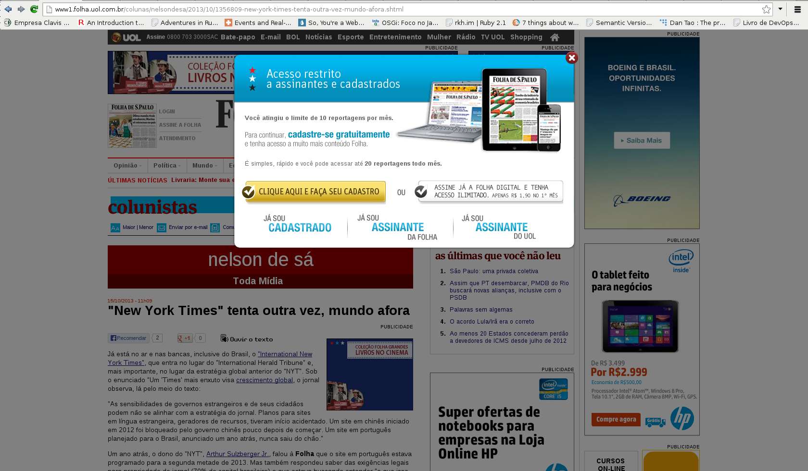

###  Folha Ilimitado
  Folha Ilimitado é uma extensão para o Google Chrome que burla o sistema, 'fodástico', diga-se de passagem, usado pelo site: www.folha.uol.com.br para restringir o número de acesso mensal à seus artigos de usuários não cadastrados.

### Instalação
  Você pode baixar a extensão diretamente clicando no link
  [download](https://github.com/raphaelivan/folha-ilimitado/blob/master/folhailimitado.crx?raw=true) ou baixar pelo [Google Web Store](https://chrome.google.com/webstore/category/apps)

  **OBS**: Caso você escolha fazer o download direto, você precisa instalar a extensão, para isso, navegue para: chrome://extensions/ ou Google > Tools(Ferramentas) > Extensions(Extensões) e arraste o arquivo .crx que você baixo para lá. :)

